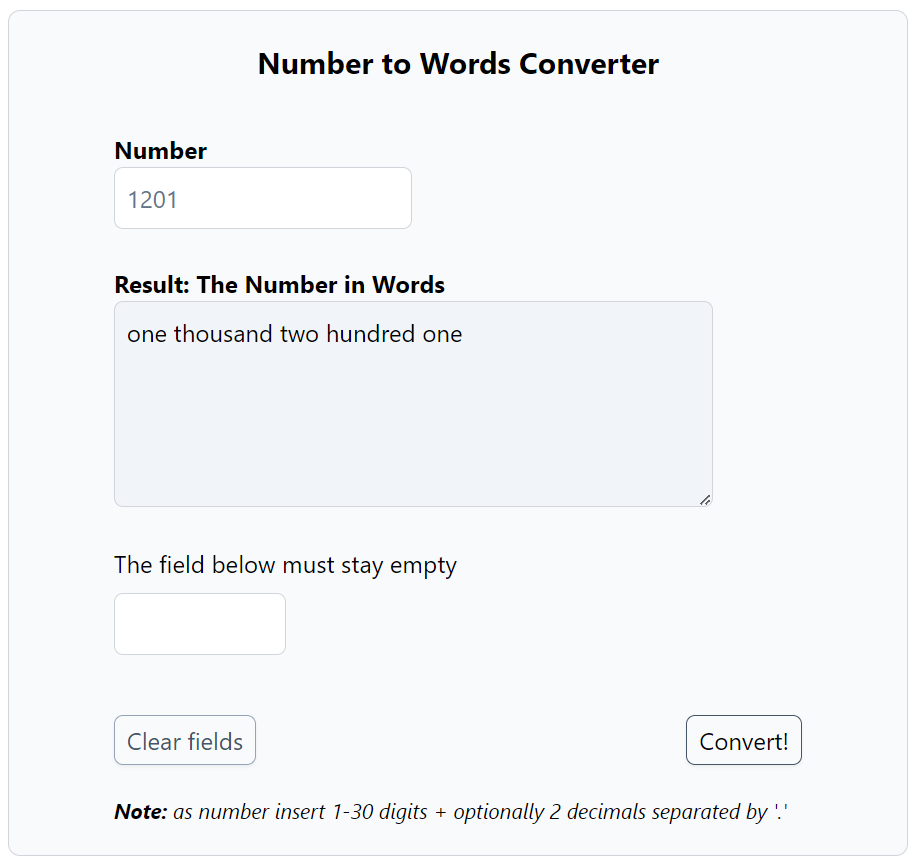

# Number to Words Converter (Front-End) 

This is a front-end-app providing conversion from a number to words, what is sometimes required for invoices, contracts etc. It currently supports numbers from one to Nonillion plus two digits after separation point (optionally).

This app uses converted words string provided by [https://github.com/conv-api](https://github.com/wie1900/conv-api).

## Screenshot

## Usage
Insert any number with length 1-30 digits (optionally: plus 1-2 digits separated by 'dot' for tenths and hundredths), e.g. 20 or 20.99 and click _Convert_. To clear both input fields choose _Clear fields_.

For security reasons the last field should stay empty (as anty-bot protection).

## Laravel quasi-module
This app is configured as separated Laravel module in /src under _conv_ folder. It's ServiceProvider is registered in the main AppServiceProvider as well as the routes config file _routes_web.php_ in the main RouteServiceProvider.

Finally, the name 'Conv' has been added to namespaces and paths under 'psr-4' in composer.json.

## Hexagonal architecture
Further, it is Hexagonal-structured:
- _App_ - for http related controllers, requests, views requiring access to the application.
- _Domain_ - DTOs, entities/models, services and interfaces (primary/secondary ports).
- _Infra_ - implementations of secondary ports of the domain (secondary adapters).

The controllers (App) use injected interfaces (primary ports) of the domain and so they are decoupled from the domain concrete services.
Likewise, the domain services use only interfaces (secondary ports) and know nothing about their implementations (secondary adapters).

All dependencies are provided by module ConvServiceProvider (registered in the main AppServiceProvider), that contains bindings interfaces -> specific classes.

## What was used

- Laravel 10
- PHP 8.2
- Tailwindcss
- Javascript

## Working version

The working version is available at:

[https://app.deadygo.com/conv](https://app.deadygo.com/conv)
