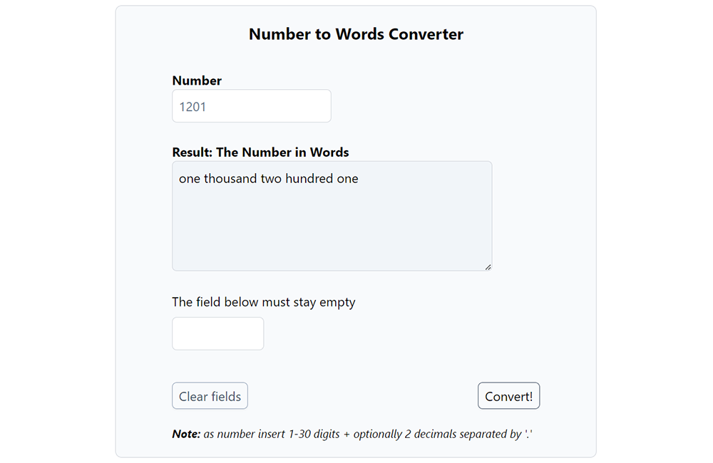

# Number to Words Converter 

This is a front-end-app providing conversion from a number to words, what is sometimes required for invoices, contracts etc. It currently supports numbers from one to Nonillion plus two digits after separation point (optionally).

This app uses converted words string provided by [https://github.com/wie1900/conv-api](https://github.com/wie1900/conv-api)

## Usage
Insert any number with length 1-30 digits (optionally: plus 1-2 digits separated by 'dot' for tenths and hundredths), e.g. 20 or 20.99 and click _Convert_. To clear both input fields choose _Clear fields_.

For security reasons the last field should stay empty (as anty-bot protection).

## Architecture
### Laravel quasi-module
This app is configured as separated Laravel module under `/src/conv` folder. Its `ConvServiceProvider` is registered in the application `AppServiceProvider` and the routes config file _`routes_web.php`_ in the application `RouteServiceProvider`.

Finally, the name `Conv` has been added to namespaces and paths under 'psr-4' in _`composer.json`_.

### Hexagonal architecture
Further, it is Hexagonal-structured:
- `App` - for http related controllers, requests, views requiring access to the application
- `Domain` - DTOs, domain entities/models, services and interfaces (primary/secondary ports, here `PortsIn`)
- `Infra` - implementations of secondary ports of the domain (secondary adapters, here `PortsOut`)

The controllers (App) use injected interfaces (primary ports, here `PortsIn`) of the domain and so they are decoupled from the domain specific services.
Likewise, the domain services use only interfaces (secondary ports, here `PortsOut`) and know nothing about their implementations (secondary adapters, folder `Infra`).

All dependencies are provided by module `AplagServiceProvider`, which contains bindings `interfaces -> specific classes`.

## What was used
- Laravel 10
- PHP 8.2
- Tailwindcss
- Javascript

## Working version

The working version is available at: 
[https://app.deadygo.com/conv](https://app.deadygo.com/conv)
